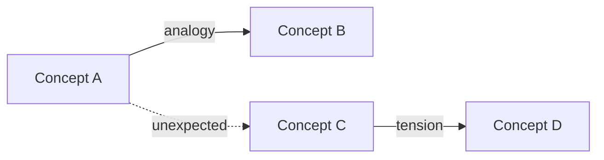

# Personal Wiki — Explore

Discover cross-domain connections, analogies, and tensions across the wiki.

## How It Works

### 1. Read the full inventory

Read `wiki/index.md` to get the complete list of all wiki pages across all categories (Sources, Entities, Concepts, Synthesis).

### 2. Read concept and entity pages

Read all pages in `wiki/concepts/` and `wiki/entities/`. If the wiki is very large (100+ pages), read a representative sample that covers the broadest range of domains and tags.

### 3. Analyze for connections

Scan the content for three types of cross-domain connections:

**Analogies**
Same pattern appearing in different domains. Look for:
- Structural similarities (e.g. feedback loops in biology AND economics)
- Shared mechanisms (e.g. network effects in social media AND epidemiology)
- Parallel frameworks (e.g. evolution in biology AND market competition)

**Tensions**
Where different domains or sources disagree on the same underlying question. Look for:
- Contradictory claims about similar phenomena across fields
- Different assumptions that lead to conflicting conclusions
- Unresolved debates where different disciplines take opposing sides

**Connection Map**
Surprising links between concepts that aren't currently wikilinked. Look for:
- Concepts from different domains that share terminology or underlying principles
- Entities that bridge multiple fields but aren't linked across those pages
- Ideas that appear in different contexts but haven't been connected

## Output Format

Present findings in chat — do not save to the wiki.

Group by connection type:

### Analogies
For each analogy found:
- The two (or more) concepts/domains involved
- Brief explanation of the structural similarity
- Which wiki pages contain the relevant information: `[[Page A]]`, `[[Page B]]`

### Tensions
For each tension found:
- The conflicting claims or assumptions
- Which domains/sources take which side
- The wiki pages involved: `[[Page A]]`, `[[Page B]]`

### Unexpected Links
For each surprising connection:
- What the connection is
- Why it's non-obvious
- The wiki pages that could be linked: `[[Page A]]` ↔ `[[Page B]]`

When useful, include a Mermaid diagram showing the connection map:

## Constraints

- **Read-only.** Do not create, modify, or delete any wiki pages.
- **No web search.** Work only with existing wiki content.
- **Chat only.** Present findings in the conversation, not as saved files.

## Related Skills

- `/wiki-ingest` — process new sources into wiki pages
- `/wiki-query` — ask questions against the wiki
- `/wiki-spark` — generate creative prompts from wiki content
