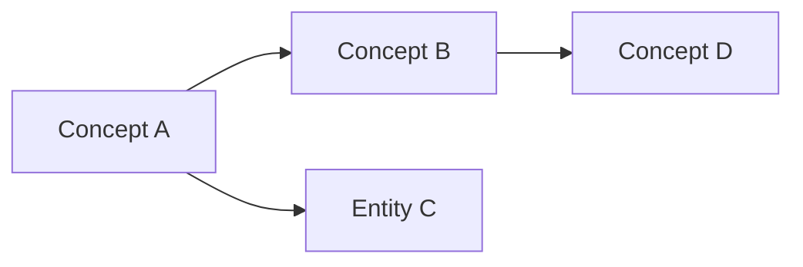

# Personal Wiki — Query

Answer questions by searching and synthesizing knowledge from the wiki.

## Search Strategy

### 1. Start with the index

Read `wiki/index.md` to identify relevant pages. Scan all category sections (Sources, Entities, Concepts, Synthesis) for entries related to the question.

### 2. Search wiki content

If the index doesn't surface enough relevant pages, use grep to search wiki page contents for keywords related to the question.

### 3. Read relevant pages

Read the wiki pages identified by the index or search. Follow `[[wikilinks]]` to pull in related context from linked pages. Read enough pages to give a thorough answer, but don't read the entire wiki.

### 4. Check raw sources if needed

If the wiki pages don't fully answer the question, check relevant source summaries in `wiki/sources/` for additional detail. Only go to files in `raw/` as a last resort.

### 5. If the wiki can't answer

The wiki is self-contained. Do not search the web. If the wiki doesn't have enough information to answer the question, say so clearly and suggest what sources the user could add to fill the gap.

## Synthesize the Answer

### Format

Match the answer format to the question:
- **Factual question** → direct answer with citations
- **Comparison** → markdown table with side-by-side analysis
- **Exploration / "how does X relate to Y"** → narrative with linked concepts
- **List/catalog** → bulleted list with brief descriptions
- **Relationships / structure** → Mermaid diagram showing connections

Example Mermaid diagram:

Use tables and Mermaid diagrams when the question naturally calls for them. Default to plain markdown otherwise.

### Citations

Always cite wiki pages using `[[wikilink]]` syntax. Example:

> According to [[Source - Article Title]], the key finding was X. This connects to the broader pattern described in [[Concept Name]], which [[Entity Name]] has also explored.

### Saving answers to the wiki

Do not offer to save answers. If the user explicitly asks to save a query result to the wiki:
1. Create a new page in `wiki/synthesis/` with proper frontmatter
2. Add an entry to `wiki/index.md` under Synthesis
3. Append to `wiki/log.md`: `## [YYYY-MM-DD] query | Question summary`

## Conventions

- **Search the wiki first.** Only go to raw sources if the wiki doesn't have the answer.
- **Never search the web.** The wiki is self-contained.
- **Cite your sources.** Every factual claim should link to the wiki page it came from.
- **Only save on explicit request.** Do not offer to save query results.
- Use `[[wikilinks]]` for all internal references. Never use raw file paths.

## Related Skills

- `/wiki-ingest` — process new sources into wiki pages
- `/wiki-lint` — health-check the wiki for issues
- `/wiki-explore` — discover cross-domain connections
- `/wiki-spark` — generate creative prompts from wiki content
